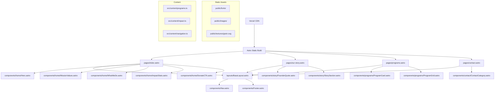
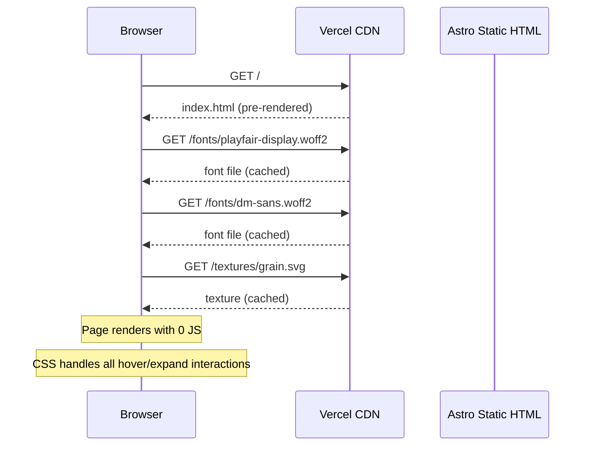
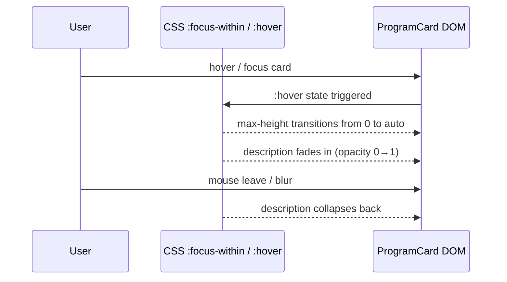
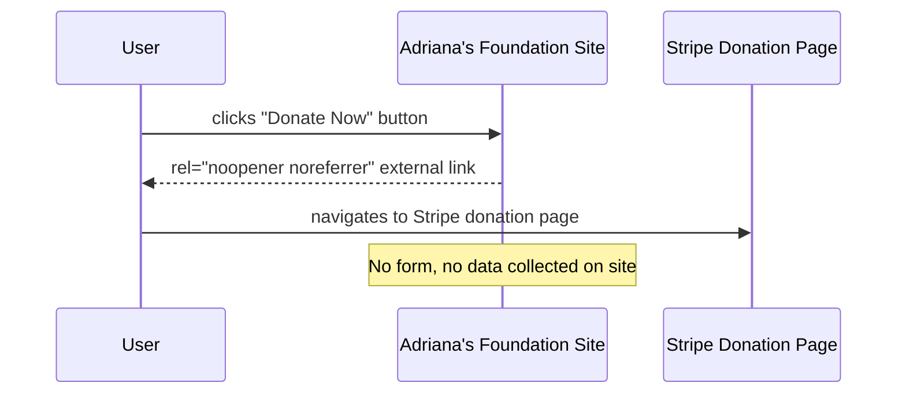

# Design Document: Adriana's Foundation Website Redesign

## Overview

A full redesign of the Adriana's Foundation website — a 501(c)(3) nonprofit empowering Latino youth and women through mentorship, education, and career development. The site is built with Astro 4 (zero JS by default), Tailwind CSS v4, and deployed to Vercel as a fully static site. The design language is modern editorial with Latino soul: deep blacks, gold accents, terracotta warmth, and typographic boldness that honors Adriana Gallardo's story and the community she serves.

The site comprises five pages — Home, Our Story, Programs, and Contact — plus a navigation dropdown for program anchor links. All donation flows are external (Stripe link), keeping the site purely informational and content-driven. The visual centerpiece is Adriana's quote treated as a full-screen typographic art piece, reinforcing the foundation's identity and emotional resonance.

---

## Architecture



---

## Sequence Diagrams

### Page Load Flow



### Program Card Expand (CSS-only)



### Donate Button Flow



---

## Components and Interfaces

### Component: `BaseLayout.astro`

**Purpose**: Root layout wrapping all pages with `<head>`, global fonts, Nav, and Footer.

**Interface**:
```typescript
interface Props {
  title: string
  description: string
  ogImage?: string
}
```

**Responsibilities**:
- Inject Fontsource font imports (Playfair Display, DM Sans, Libre Baskerville)
- Set `<meta>` tags for SEO and Open Graph
- Render `<Nav />` and `<Footer />` around `<slot />`
- Apply global CSS custom properties for the design system

---

### Component: `Nav.astro`

**Purpose**: Site-wide navigation with a "Programming" dropdown linking to program section anchors on `/programs`.

**Interface**:
```typescript
interface NavItem {
  label: string
  href: string
  children?: NavItem[]
}

interface Props {
  items: NavItem[]
  currentPath: string
}
```

**Responsibilities**:
- Render top-level nav links: Home, Our Story, Programming (dropdown), Contact Us
- Render dropdown sub-items as anchor links to `/programs#[slug]`
- Mark active page via `aria-current="page"`
- CSS-only dropdown (`:focus-within` / `:hover`) — zero JS
- Mobile: hamburger toggle via CSS checkbox hack or `<details>` element

---

### Component: `Hero.astro`

**Purpose**: Full-viewport hero section with diagonal large text, community photo, dark overlay, and grain texture.

**Interface**:
```typescript
interface Props {
  headline: string        // "SHAPING FUTURE LEADERS"
  subheadline: string     // "Mentorship, training, and career pathways..."
  imageSrc: string        // optimized via @astrojs/image
  imageAlt: string
  ctaLabel: string
  ctaHref: string
}
```

**Responsibilities**:
- Render full-viewport section with background image + dark overlay (`rgba(10,10,10,0.65)`)
- Apply grain texture SVG overlay for editorial texture
- Display headline in Playfair Display, large, with diagonal/skewed CSS transform
- Gold horizontal rule accent below headline
- Render CTA button linking to `/programs` or donate

---

### Component: `MissionValues.astro`

**Purpose**: Mission, Vision, and Core Values section in a two-column editorial layout.

**Interface**:
```typescript
interface Value {
  label: string   // "Growth", "Opportunity", "Knowledge", "Integrity"
  icon?: string   // optional SVG icon name
}

interface Props {
  mission: string
  vision: string
  values: Value[]
}
```

**Responsibilities**:
- Display Mission and Vision as large editorial text blocks
- Render Values as a horizontal pill/tag row with gold accent
- Use cream background (`#FAF7F2`) to contrast with dark hero above

---

### Component: `ImpactStats.astro`

**Purpose**: Large-number impact statistics with gold numerals and scroll-triggered CSS animation.

**Interface**:
```typescript
interface Stat {
  value: string   // "3,500", "5,000", "15", "50", "150"
  label: string   // "Toys Distributed", "Families Served", etc.
}

interface Props {
  headline: string
  subheadline: string
  stats: Stat[]
}
```

**Responsibilities**:
- Render stats in a responsive grid (2-col mobile, 3–5 col desktop)
- Gold (`#D4A017`) large numerals in Playfair Display
- Labels in DM Sans
- CSS `@keyframes` count-up animation triggered by `IntersectionObserver` (minimal inline `<script>` tag, or CSS animation-delay approach)
- Dark background section for contrast

---

### Component: `FounderQuote.astro`

**Purpose**: Full-screen typographic art piece featuring Adriana's signature quote.

**Interface**:
```typescript
interface Props {
  quote: string   // "From undocumented immigrant to insurance empire..."
  attribution: string  // "— Adriana Gallardo, Founder"
}
```

**Responsibilities**:
- Full-viewport section, dark background
- Quote in Libre Baskerville italic, oversized, centered or left-aligned with dramatic leading
- Gold accent line or decorative quotation mark
- Attribution in DM Sans, small caps
- Optional: subtle grain texture overlay

---

### Component: `ProgramCard.astro`

**Purpose**: Individual program card with title visible by default; description expands on hover/focus.

**Interface**:
```typescript
interface Program {
  id: string          // slug, e.g. "elevate-academy"
  title: string
  tagline: string     // short one-liner
  description: string // full paragraph
  goals: string[]
  keyComponents: string[]
  category: 'mentorship' | 'sports' | 'community' | 'partnership'
  icon?: string       // SVG icon name
}

interface Props {
  program: Program
}
```

**Responsibilities**:
- Render card with `id={program.id}` for anchor link navigation from Nav dropdown
- Default state: title + tagline visible, terracotta accent border
- Hover/focus state: description slides in via CSS `max-height` transition
- "Learn More" chevron rotates on expand
- Accessible: keyboard navigable, `aria-expanded` managed via CSS `:focus-within`

---

### Component: `ProgramGrid.astro`

**Purpose**: Asymmetric grid layout for all 8 program cards.

**Interface**:
```typescript
interface Props {
  programs: Program[]
}
```

**Responsibilities**:
- CSS Grid with asymmetric column spans (some cards span 2 cols for visual rhythm)
- Responsive: single column on mobile, 2-col tablet, 3-col desktop
- Section intro text above grid

---

### Component: `ContactCategory.astro`

**Purpose**: Single contact category block with label and email link.

**Interface**:
```typescript
interface ContactEntry {
  category: string   // "General Inquiries", "Partnerships", etc.
  description: string
  email: string
}

interface Props {
  entry: ContactEntry
}
```

**Responsibilities**:
- Render category heading, description, and `mailto:` link
- Gold underline on email hover
- Accessible link text

---

### Component: `DonateCTA.astro`

**Purpose**: Prominent donation call-to-action section with multiple giving methods.

**Interface**:
```typescript
interface Props {
  stripeUrl: string
  mailAddress: {
    name: string
    street: string
    city: string
  }
  phone: string
  email: string
}
```

**Responsibilities**:
- Gold primary button linking externally to Stripe (`target="_blank" rel="noopener noreferrer"`)
- Mail address block with formatted address
- Phone and email as `tel:` and `mailto:` links
- Dark section background with gold accents

---

## Data Models

### `Program`

```typescript
interface Program {
  id: string
  title: string
  tagline: string
  description: string
  goals: string[]
  keyComponents: string[]
  category: 'mentorship' | 'sports' | 'community' | 'partnership'
  icon?: string
}
```

**Validation Rules**:
- `id` must be kebab-case, unique across all programs
- `title` must be non-empty
- `goals` must have at least one entry
- `keyComponents` must have at least one entry

---

### `Stat`

```typescript
interface Stat {
  value: string
  label: string
  suffix?: string   // e.g. "+" for "150+"
}
```

---

### `NavItem`

```typescript
interface NavItem {
  label: string
  href: string
  children?: NavItem[]
}
```

**Validation Rules**:
- `href` must be a valid relative path or anchor (`#slug`)
- `children` only valid on top-level items
- Max one level of nesting

---

### Design Tokens (Tailwind CSS v4 `@theme`)

```css
@theme {
  --color-bg-dark: #0A0A0A;
  --color-bg-light: #FAF7F2;
  --color-gold: #D4A017;
  --color-terracotta: #C4622D;
  --color-text-light: #FFFFFF;
  --color-text-dark: #1A1A1A;

  --font-display: 'Playfair Display', Georgia, serif;
  --font-body: 'DM Sans', system-ui, sans-serif;
  --font-accent: 'Libre Baskerville', Georgia, serif;

  --spacing-section: 6rem;
  --radius-card: 0.5rem;
}
```

---

## Algorithmic Pseudocode

### Navigation Dropdown (CSS-only)

```pascal
ALGORITHM renderNavDropdown(items)
INPUT: items of type NavItem[]
OUTPUT: accessible HTML nav with CSS-driven dropdown

BEGIN
  FOR each item IN items DO
    IF item.children IS NOT EMPTY THEN
      RENDER <div class="group relative">
        RENDER <button aria-haspopup="true">item.label</button>
        RENDER <ul class="hidden group-hover:block group-focus-within:block">
          FOR each child IN item.children DO
            RENDER <li><a href=child.href>child.label</a></li>
          END FOR
        </ul>
      </div>
    ELSE
      RENDER <a href=item.href aria-current=isActive(item.href)>item.label</a>
    END IF
  END FOR
END
```

**Preconditions**:
- `items` is a non-empty array of `NavItem`
- All `href` values are valid paths

**Postconditions**:
- Dropdown is accessible via keyboard (`:focus-within`)
- Active page link has `aria-current="page"`
- Zero JavaScript required

---

### Program Card Expand (CSS `max-height` transition)

```pascal
ALGORITHM programCardExpand(card)
INPUT: card DOM element with .program-card class
OUTPUT: smooth expand/collapse of description panel

BEGIN
  // Default state
  SET card.description.maxHeight = 0
  SET card.description.opacity = 0
  SET card.description.overflow = hidden

  // Hover/focus state (CSS handles this declaratively)
  ON card:hover OR card:focus-within DO
    TRANSITION card.description.maxHeight FROM 0 TO 500px OVER 300ms ease
    TRANSITION card.description.opacity FROM 0 TO 1 OVER 200ms ease
    ROTATE card.chevron BY 180deg
  END ON

  // Leave state
  ON card:not(:hover) AND card:not(:focus-within) DO
    TRANSITION card.description.maxHeight FROM 500px TO 0 OVER 300ms ease
    TRANSITION card.description.opacity FROM 1 TO 0 OVER 150ms ease
    ROTATE card.chevron BY 0deg
  END ON
END
```

**Preconditions**:
- Card element exists in DOM
- Description content is pre-rendered in HTML (Astro SSG)

**Postconditions**:
- Expand/collapse works without JavaScript
- Transition is smooth (300ms)
- Keyboard accessible via `:focus-within`

---

### Impact Stats Count-Up Animation

```pascal
ALGORITHM countUpAnimation(statElements)
INPUT: statElements — NodeList of .stat-value elements
OUTPUT: animated number count from 0 to target value

BEGIN
  observer ← new IntersectionObserver(threshold=0.5)

  FOR each el IN statElements DO
    observer.observe(el)
  END FOR

  ON element enters viewport DO
    target ← parseInt(el.dataset.value)
    duration ← 1500ms
    startTime ← performance.now()

    FUNCTION tick(currentTime)
      elapsed ← currentTime - startTime
      progress ← min(elapsed / duration, 1)
      easedProgress ← easeOutCubic(progress)
      current ← floor(easedProgress * target)
      el.textContent ← formatNumber(current)

      IF progress < 1 THEN
        requestAnimationFrame(tick)
      END IF
    END FUNCTION

    requestAnimationFrame(tick)
  END ON
END

FUNCTION easeOutCubic(t)
  RETURN 1 - (1 - t)^3
END FUNCTION
```

**Preconditions**:
- `IntersectionObserver` available (modern browsers; graceful degradation shows final value)
- Each stat element has `data-value` attribute with numeric string

**Postconditions**:
- Numbers animate from 0 to target over 1500ms
- Animation triggers once when element enters viewport
- Falls back to static display if JS unavailable

**Loop Invariants**:
- `progress` is always in range [0, 1]
- `current` is always ≤ `target`

---

### Anchor Link Navigation (Programs Page)

```pascal
ALGORITHM resolveAnchorLinks(navItems)
INPUT: navItems — dropdown children with href="#slug"
OUTPUT: smooth scroll to program card section

BEGIN
  FOR each item IN navItems.children DO
    slug ← extractSlug(item.href)  // e.g. "elevate-academy"
    target ← document.getElementById(slug)

    ASSERT target IS NOT NULL

    item.addEventListener("click", event)
      event.preventDefault()
      target.scrollIntoView(behavior="smooth", block="start")
    END addEventListener
  END FOR
END
```

**Preconditions**:
- Each program card has `id` matching the nav item slug
- Nav dropdown children have `href` in format `/programs#[slug]`

**Postconditions**:
- Clicking nav item scrolls to correct program card
- URL updates to `/programs#[slug]`
- Works without JS via native anchor fallback

---

## Key Functions with Formal Specifications

### `getPrograms(): Program[]`

```typescript
function getPrograms(): Program[]
```

**Preconditions**:
- `src/content/programs.ts` exports a valid `Program[]` array
- All program `id` values are unique

**Postconditions**:
- Returns array of exactly 8 programs
- Each program satisfies the `Program` interface
- Programs are ordered as defined in content file

**Loop Invariants**: N/A (pure data retrieval)

---

### `slugify(title: string): string`

```typescript
function slugify(title: string): string
```

**Preconditions**:
- `title` is a non-empty string

**Postconditions**:
- Returns lowercase kebab-case string
- All spaces replaced with `-`
- Special characters removed
- Result is a valid HTML `id` attribute value

---

### `buildNavItems(): NavItem[]`

```typescript
function buildNavItems(): NavItem[]
```

**Preconditions**:
- `getPrograms()` returns valid program array

**Postconditions**:
- Returns top-level nav items: Home, Our Story, Programming, Contact Us
- "Programming" item has `children` array of 8 program anchor links
- Each child `href` is `/programs#[program.id]`

---

## Example Usage

### Page: `pages/programs.astro`

```typescript
---
import BaseLayout from '../layouts/BaseLayout.astro'
import ProgramGrid from '../components/programs/ProgramGrid.astro'
import { getPrograms } from '../content/programs'

const programs = getPrograms()
---

<BaseLayout
  title="Programs — Adriana's Foundation"
  description="Explore all 8 programs empowering Latino youth and women."
>
  <section class="py-24 bg-[#0A0A0A]">
    <div class="max-w-7xl mx-auto px-6">
      <h1 class="font-display text-5xl text-white mb-4">Our Programs</h1>
      <p class="font-body text-white/70 text-lg max-w-2xl mb-16">
        From mentorship to soccer academies, every program is designed to
        create access, build confidence, and open doors.
      </p>
      <ProgramGrid programs={programs} />
    </div>
  </section>
</BaseLayout>
```

### Component: `ProgramCard.astro`

```typescript
---
import type { Program } from '../../content/programs'

interface Props {
  program: Program
}

const { program } = Astro.props
---

<article
  id={program.id}
  class="group relative bg-[#111] border border-white/10 rounded-lg p-6
         hover:border-[#C4622D] transition-colors duration-300 cursor-pointer"
>
  <h3 class="font-display text-2xl text-white mb-2">{program.title}</h3>
  <p class="font-body text-[#D4A017] text-sm mb-4">{program.tagline}</p>

  <!-- Expandable description -->
  <div class="max-h-0 overflow-hidden opacity-0
              group-hover:max-h-[500px] group-hover:opacity-100
              group-focus-within:max-h-[500px] group-focus-within:opacity-100
              transition-all duration-300 ease-in-out">
    <p class="font-body text-white/80 text-sm leading-relaxed">
      {program.description}
    </p>
  </div>

  <!-- Chevron -->
  <span class="absolute bottom-4 right-4 text-[#D4A017]
               group-hover:rotate-180 transition-transform duration-300">
    ›
  </span>
</article>
```

### Component: `FounderQuote.astro`

```typescript
---
interface Props {
  quote: string
  attribution: string
}

const { quote, attribution } = Astro.props
---

<section class="min-h-screen bg-[#0A0A0A] flex items-center justify-center
                relative overflow-hidden px-8">
  <!-- Grain texture overlay -->
  <div class="absolute inset-0 opacity-30 bg-[url('/textures/grain.svg')]
              bg-repeat pointer-events-none" aria-hidden="true" />

  <blockquote class="relative z-10 max-w-5xl text-center">
    <!-- Decorative quote mark -->
    <span class="block font-accent text-[#D4A017] text-[8rem] leading-none
                 opacity-30 select-none mb-[-2rem]" aria-hidden="true">"</span>

    <p class="font-accent italic text-white text-3xl md:text-5xl lg:text-6xl
              leading-tight tracking-tight">
      {quote}
    </p>

    <footer class="mt-8">
      <cite class="font-body text-[#D4A017] text-sm uppercase tracking-widest
                   not-italic">
        {attribution}
      </cite>
    </footer>
  </blockquote>
</section>
```

---

## Correctness Properties

- For all pages P in the site, P renders valid HTML with no JavaScript required for core content display
- For all program cards C, C has a unique `id` attribute matching its slug, enabling anchor navigation
- For all external links L (donate buttons), L has `rel="noopener noreferrer"` and `target="_blank"`
- For all email links E in the contact page, E uses `mailto:` protocol with the correct address
- For all images I rendered via `@astrojs/image`, I has a non-empty `alt` attribute
- For all nav dropdown items D, D links to `/programs#[slug]` where `[slug]` matches an existing program card `id`
- For all font resources F loaded via Fontsource, F is self-hosted and does not make external network requests
- The `FounderQuote` component always renders with `min-h-screen` ensuring full-viewport display
- The `ImpactStats` count-up animation degrades gracefully: if JS is unavailable, final numeric values are displayed statically

---

## Error Handling

### Missing Program Content

**Condition**: A program in `programs.ts` is missing required fields (`title`, `description`, `goals`)
**Response**: TypeScript compile-time error via interface enforcement; build fails with descriptive message
**Recovery**: Developer corrects content data before deployment

### Broken Anchor Link

**Condition**: Nav dropdown item references `#slug` that doesn't match any program card `id`
**Response**: Browser scrolls to top of page (native anchor fallback)
**Recovery**: `buildNavItems()` derives slugs from the same `getPrograms()` source, making mismatch impossible if both use `slugify()`

### External Stripe Link Unavailable

**Condition**: Stripe donation URL is unreachable
**Response**: Browser shows standard "site can't be reached" error — no impact on foundation site
**Recovery**: Update `stripeUrl` prop in `DonateCTA.astro`; site itself is unaffected

### Image Optimization Failure

**Condition**: `@astrojs/image` cannot process a source image (wrong format, missing file)
**Response**: Astro build fails with error pointing to the problematic image
**Recovery**: Ensure all images in `public/images/` are valid formats (JPEG, PNG, WebP, AVIF)

### Font Loading Failure

**Condition**: Fontsource font files fail to load (network issue, misconfigured path)
**Response**: Browser falls back to system serif/sans-serif fonts; layout remains intact
**Recovery**: Verify Fontsource packages are installed and imported in `BaseLayout.astro`

---

## Testing Strategy

### Unit Testing Approach

Test pure utility functions in isolation:
- `slugify()`: verify kebab-case output for various title strings including special characters and accents
- `buildNavItems()`: verify correct structure, 8 program children, valid href format
- `getPrograms()`: verify exactly 8 programs returned, all required fields present

**Test framework**: Vitest (standard for Astro projects)

### Property-Based Testing Approach

**Property Test Library**: fast-check

Key properties to test:
- `slugify(title)` always returns a string matching `/^[a-z0-9-]+$/`
- `buildNavItems()` children count always equals `getPrograms().length`
- For any `Program` with non-empty `title`, `slugify(title)` produces a non-empty string
- All program `id` values in `getPrograms()` are unique (no duplicates)

### Integration Testing Approach

- Astro build (`astro build`) completes without errors
- All 4 pages render valid HTML (validate with `html-validate`)
- All anchor links in nav dropdown resolve to existing `id` attributes on `/programs`
- All `mailto:` links use correct email addresses from `contact-us.md`
- Lighthouse accessibility score ≥ 90 on all pages

---

## Performance Considerations

- **Zero JS by default**: Astro's island architecture means no JavaScript ships unless explicitly added. The count-up animation is the only optional JS enhancement.
- **Font subsetting**: Fontsource packages include only the character subsets needed; Latin subset is sufficient for this site.
- **Image optimization**: `@astrojs/image` generates WebP/AVIF variants with responsive `srcset`; hero image should be provided at 2400px wide minimum.
- **Grain texture**: Implemented as a small repeating SVG (< 2KB) rather than a PNG to minimize asset size.
- **CSS-only interactions**: All hover states, dropdown menus, and card expansions use CSS transitions — no JS event listeners, no layout thrash.
- **Vercel CDN**: Static assets served from edge nodes globally; `Cache-Control: public, max-age=31536000, immutable` for hashed assets.

---

## Security Considerations

- **No forms, no user input**: The site collects zero user data. No CSRF, XSS, or injection vectors exist.
- **External links**: All donate/Stripe links use `rel="noopener noreferrer"` to prevent tab-napping.
- **Email obfuscation**: `mailto:` links are acceptable for a nonprofit; if spam becomes an issue, consider CSS-based obfuscation or a contact form with server-side handling.
- **Content Security Policy**: Vercel headers can enforce a strict CSP since no third-party scripts are loaded.
- **Dependency pinning**: All npm packages pinned to exact versions in `package.json` to prevent supply-chain drift.

---

## Dependencies

| Package | Version | Purpose |
|---|---|---|
| `astro` | `^4.x` | Static site framework |
| `@astrojs/tailwind` | `^5.x` | Tailwind CSS v4 integration |
| `tailwindcss` | `^4.x` | Utility-first CSS |
| `@astrojs/image` | `^0.18.x` | Image optimization |
| `@fontsource/playfair-display` | `^5.x` | Display font (self-hosted) |
| `@fontsource/dm-sans` | `^5.x` | Body font (self-hosted) |
| `@fontsource/libre-baskerville` | `^5.x` | Accent/quote font (self-hosted) |
| `@fontsource/cormorant-garamond` | `^5.x` | Alternate display font (self-hosted) |
| `vitest` | `^1.x` | Unit testing |
| `fast-check` | `^3.x` | Property-based testing |
| `html-validate` | `^8.x` | HTML validation in CI |
